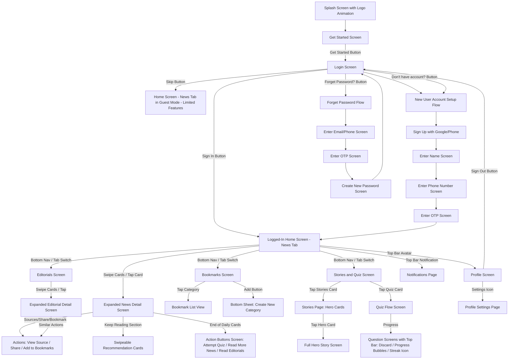
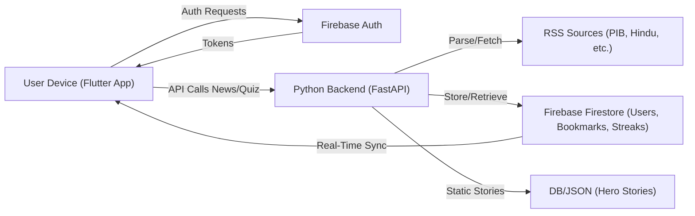
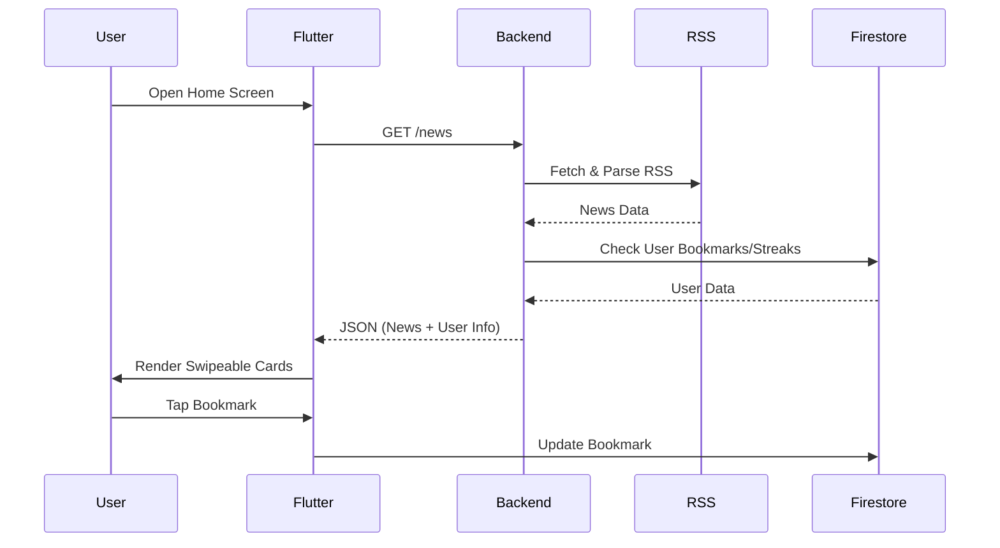
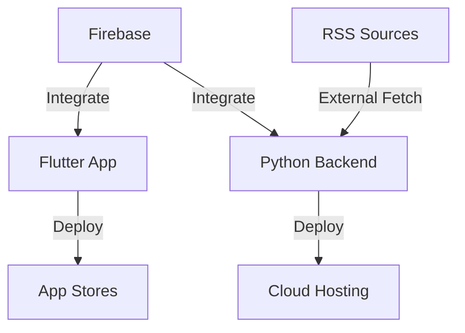

### File Organization in the Codebase

#### Project Structure

```
comrade/
├── frontend/                    # Flutter frontend application
│   ├── android/                 # Android-specific configurations
│   ├── ios/                     # iOS-specific configurations  
│   ├── lib/
│   │   ├── main.dart            # App entry point with BLoC setup
│   │   ├── auth/                # Authentication feature module
│   │   ├── core/                # Shared utilities and constants
│   │   ├── home/                # Home screen with news feed
│   │   ├── news/                # News feature models
│   │   ├── editorials/          # Editorial content feature
│   │   ├── bookmarks/           # Bookmark management
│   │   ├── stories/             # Stories & Quiz feature
│   │   └── profile/             # User profile feature
│   ├── assets/                  # Static resources
│   ├── pubspec.yaml             # Flutter dependencies & configuration
│   ├── analysis_options.yaml    # Dart/Flutter linting rules
│   └── test/                    # Unit & widget tests
├── backend/                     # Python FastAPI backend
│   ├── main.py                  # FastAPI application entry point
│   ├── config.py                # Environment variables & settings
│   ├── requirements.txt         # Python dependencies
│   ├── .env.example             # Environment variables template
│   ├── routers/                 # API route handlers
│   │   ├── auth_router.py       # Authentication endpoints
│   │   ├── news_router.py       # News & RSS feed endpoints
│   │   └── quiz_router.py       # Quiz generation endpoints
│   └── models/                  # Pydantic data models
│       ├── user.py              # User model schemas
│       ├── news.py              # News item schemas
│       └── quiz.py              # Quiz question schemas
├── docs/                        # Documentation & design files
└── README.md                    # This file
```

#### Overall Project Additions
- **Root Level**:
  - `docs/`: Figma files, user flows (Mermaid diagrams as text files), API specs (e.g., OpenAPI from FastAPI).
  - `.gitignore`: Ignore `build/`, `__pycache__`, `.flutter-plugins`.
  - `docker-compose.yml`: Optional for local dev (run backend + DB).
- **Version Control**: Git branches: `main` (stable), `develop` (WIP), feature branches like `feature/auth-flow`.
- **Tools**: Prettier/ESLint for code formatting; add `analysis_options.yaml` in Flutter for linting.

### User Flow Sequence Mermaid Diagram


This diagram starts from app launch and branches into auth, core features, and sub-flows. Arrows indicate navigation triggers (e.g., buttons, taps, swipes).

### UI Screens Descriptions for Each Flow
Drawing directly from your provided data and Figma-inspired screenshots (e.g., dark mode, swipeable cards like X/Grok, profile stats like fitness apps, promotional cards like Magna City), here are detailed descriptions for each screen. I've included layout, elements, interactions, and visual notes. Screens are grouped by flow for clarity.

#### 1. Splash Screen
- **Purpose:** Initial loading/branding screen.
- **Layout:** Full-screen with centered logo animation (e.g., military emblem fading in/out). Dark background for a serious, aspirational tone.
- **Elements:**
  - Animated logo (e.g., Indian flag or defense insignia with subtle particle effects).
  - No interactive elements; auto-transitions to Get Started after 3-5 seconds.
- **Interactions:** None (passive).
- **Visual Notes:** Inspired by your Magna City splash—clean, immersive with nature/military-themed subtle animation.

#### 2. Get Started Screen
- **Purpose:** Welcome and onboarding entry.
- **Layout:** Full-screen background GIF loop (military video, e.g., soldiers training). Centered content stack.
- **Elements:**
  - Big Title: "Welcome Comrade" (bold, white text).
  - Subtitle: "Enjoy Your stay in future and invest in shaping it" (smaller, gray text).
  - Get Started Button: White background, rounded corners, black text, centered.
  - Bottom Rich Text: "By Continuing you agree to Terms and Conditions" (with embedded link to policy URL; tappable blue underline).
- **Interactions:** Tap button → Login Screen.
- **Visual Notes:** Motivational like "Explore Saudi" screenshot—overlay text on dynamic background.

#### 3. Login Screen
- **Purpose:** User authentication.
- **Layout:** Vertical stack: Top logo, title, form fields, buttons, alternatives.
- **Elements:**
  - Skip Text Button (small, gray, top-right).
  - Logo at top (centered, smaller than splash).
  - Title: "Welcome Back" (bold).
  - Text Fields: Email and Password (with secure entry).
  - Forget Password? Text Button (blue, underlined).
  - Sign In Button: White BG, rounded, black text.
  - "or" Divider Text.
  - Sign In with Google Button (Google icon + text).
  - Sign In with Phone Button (Phone icon + text).
  - Don't have an account? Text Button (blue, underlined).
- **Interactions:** Sign In → Home; Google/Phone → Setup Flow; Forget → Forget Flow; Skip → Guest Home (limited).
- **Visual Notes:** Form-heavy like standard login; dark mode consistent.

#### 4. New User Account Setup Flow Screens
- **Purpose:** Onboard new users post-Google/Phone sign-in.
- **Layout:** Sequential full-screen forms, progress indicators (dots at top).
- **Screen 1: Sign Up with Google/Phone**
  - Auto-handled by auth provider; redirects to next.
- **Screen 2: What's your name?**
  - Title: "What's your name?"
  - Text Field: Single input for name.
  - Continue Button: White BG, rounded.
- **Screen 3: What's your phone number?**
  - Title: "What's your phone number?"
  - Text Field: Phone input (with country code dropdown).
  - Continue Button.
- **Screen 4: Enter the OTP Code**
  - Title: "Enter the OTP Code we sent to [number]."
  - OTP Input Fields (6 digits, auto-focus).
  - Resend OTP Button (timer-based).
  - Verify Button → Home.
- **Interactions:** Linear progression; back buttons to previous.
- **Visual Notes:** Minimalist, like OTP screens in apps; secure feel.

#### 5. Forget Password Flow Screens
- **Purpose:** Password recovery.
- **Layout:** Similar to setup—sequential forms.
- **Screen 1: Find your account**
  - Title: "Find your account"
  - Subtitle: "Enter the email or phone associated with your account."
  - Text Field: Email/Phone input.
  - Submit Button.
- **Screen 2: Enter the OTP Code**
  - Same as setup OTP screen.
- **Screen 3: Create New Password**
  - Title: "Create New Password"
  - Text Fields: New Password, Confirm Password.
  - Submit Button → Login.
- **Interactions:** Linear; error handling for invalid inputs.
- **Visual Notes:** Standard recovery UI; error messages in red.

#### 6. Logged-In User Flow: Home Screen (News Tab)
- **Purpose:** Core news consumption.
- **Layout:** Top bar + swipeable card stack (vertical like Tinder for news).
- **Elements:**
  - Top Bar: Leading Avatar (tap → Profile), Trailing Notification Icon (tap → Notifications).
  - Stacked Cards: Each with Image (top) + Headline (bottom overlay).
  - On Tap: Expands to full screen—blurred background image, detailed description.
  - Bottom Actions on Expanded: Sources (link), Share (system share sheet), Bookmark (add to list).
  - Keep Reading: Horizontal swipeable small cards (recommendations).
  - End of Cards: Custom screen with buttons—Attempt Quiz, Read More News (date filter), Read Editorials.
- **Interactions:** Swipe cards, tap expand/collapse, actions.
- **Visual Notes:** Like your Grok news screenshots—swipeable, "Keep Reading" section.

#### 7. Editorials Screen
- **Purpose:** Dedicated editorial reading.
- **Layout:** Identical to News but with editorial-specific cards.
- **Elements:** Swipeable cards (image + title/author/source), expand to full details.
- **Interactions:** Same as News.
- **Visual Notes:** Tailored cards showing newspaper source/author prominently.

#### 8. Bookmarks Screen
- **Purpose:** Manage saved content.
- **Layout:** Grid/list of categories (like X "Spaces" screenshot).
- **Elements:**
  - Default Categories: Read Later, Important, Curious (icons + names, e.g., book for Read Later).
  - Add Button (floating bottom): Opens bottom sheet for new category name.
  - Tap Category: List of bookmarked news/editorials.
- **Interactions:** Tap to view, long-press to remove.
- **Visual Notes:** Card-based like your Spaces screenshot—private/public indicators optional.

#### 9. Stories and Quiz Screen
- **Purpose:** Inspiration and testing.
- **Layout:** Two prominent cards (stacked vertically).
- **Elements:**
  - Card 1: "Stories of Guts and Glory" (filled BG image of heroes, big title, "Read More" button).
  - Card 2: "Today's Quiz" (title, "Start Quiz" button).
- **Stories Flow:**
  - Stories Page: Grid of hero cards (image + name).
  - Tap: Full Story Screen (detailed bio, images).
- **Quiz Flow:**
  - Quiz Screen: Text-based questions (MCQ), top bar—X (discard), progress bubbles (fill on answer), streak icon.
  - No heavy animations; simple progression.
- **Interactions:** Tap cards to enter sub-flows.
- **Visual Notes:** Promotional like "Stories of Guts and Glory" screenshot—heroic imagery.

#### 10. Profile Screen
- **Purpose:** User stats and management.
- **Layout:** Top bar + vertical sections.
- **Elements:**
  - Top Bar: Back Button (← Home), Settings Icon (→ Settings Page).
  - Left: Big Name + Username.
  - Right: Big Profile Photo/Avatar.
  - Streaks Card: Row of energy icons (filled yellow for practiced days, white for not; weekday labels below, e.g., M T W T F S).
  - Practice Stats: Cards/boxes—Current Streak (e.g., 2), Best Streak (2), Classes/Quizzes Taken (4), Minutes Practiced (8).
  - Sign Out Button (red outline).
- **Interactions:** Taps for navigation.
- **Visual Notes:** Exactly like your John Doe profile screenshot—bolts for streaks, stats in bold numbers.

### Technical Blueprint
This blueprint outlines the high-level tech decisions for your Flutter + Python full-stack MVP.

- **Frontend (Flutter):**
  - Framework: Flutter 3.x for cross-platform UI.
  - State Management: BLoC for auth/news state.
  - Key Packages: `firebase_auth`, `cloud_firestore`, `http` (for backend APIs), `flutter_swiper` (swipeable cards), `shared_preferences` (guest mode), `url_launcher` (links/shares), `flutter_native_splash` (splash), `pin_code_fields` (OTP).
  - UI Theme: Dark mode default (black BG, white text); custom fonts for military feel (e.g., sans-serif bold).
  - Navigation: `MaterialApp` with `Navigator` for stacks; bottom nav bar for tabs (News, Editorials, Bookmarks, Stories/Quiz).

- **Backend (Python):**
  - Framework: FastAPI for APIs (endpoints: /news, /editorials, /stories, /quiz, /bookmarks).
  - Data Sources: `feedparser` for RSS; SQLite/Firestore for user data.
  - Auth: Integrated with Firebase (tokens verified in APIs).
  - Quiz Logic: NLTK for keyword extraction from news; generate 5-10 MCQs dynamically.
  - Server: Uvicorn for dev; cron-like scheduling (e.g., APScheduler) for daily RSS fetch.

- **Database:**
  - Firebase Firestore: Users, bookmarks, streaks, quiz history (real-time sync).
  - Local Cache: Hive or SQFLite for offline news.

- **Security:** Firebase rules for data access; HTTPS for APIs; input validation.

- **Scalability:** Start with free tiers; add caching (Redis) later.

### Diagrams
#### Architecture Diagram (Mermaid)
High-level system architecture.



#### Data Flow Sequence Diagram (Mermaid)
Sequence for fetching and displaying news.



#### Deployment Diagram (Mermaid)
Deployment setup.



### Development Setup and Workflow
Detailed, practical steps without vague timelines—focus on sequential tasks.

1. **Environment Setup:**
   - Install Flutter: Download from flutter.dev; run `flutter doctor` to verify (needs Android Studio/Xcode for emulators).
   - Install Python: 3.10+; create virtual env `python -m venv env`.
   - Firebase: Create project at console.firebase.google.com; add iOS/Android apps; download config files to Flutter.
   - IDE: VS Code (with Flutter/Dart extensions) for frontend; PyCharm/VS Code for backend.

2. **Project Structure:**
   - Flutter: `lib/` (main.dart, screens/, widgets/, providers/, services/ for APIs).
   - Python: `app/` (main.py for FastAPI, routers/, models/, utils/ for RSS parsing).

3. **Workflow:**
   - **Version Control:** Init Git repo; branch per feature (e.g., `feature/auth`).
   - **Dev Cycle:** 
     - Backend First: Run `uvicorn main:app --reload`; build/test APIs with Postman (e.g., fetch news).
     - Frontend: `flutter run` on emulator; integrate APIs (http.get to backend URL).
     - Testing: Unit (Flutter test), Integration (e.g., auth flows); manual on devices.
   - **Daily Fetch:** In backend, add endpoint triggered by cron (Heroku scheduler) to update news.
   - **Build & Deploy:**
     - Backend: `heroku create`; git push; set env vars (e.g., Firebase keys).
     - Flutter: `flutter build apk` (Android); `flutter build ios` (iOS); upload to stores.
   - **Iteration:** Use Firebase Analytics for user feedback; add features post-MVP.
   - **Tools:** Hot reload in Flutter for UI tweaks; debug with breakpoints.